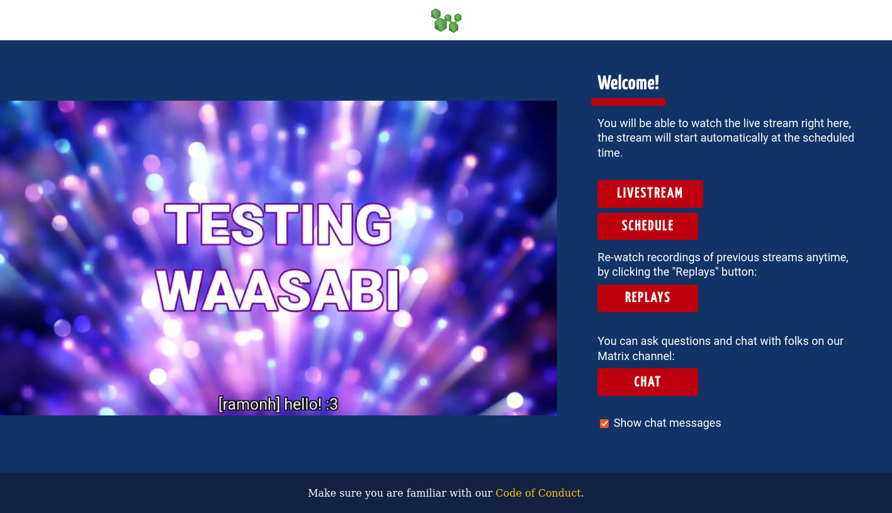

# Chat integrations

Waasabi currently supports integrating with the [Matrix.org](https://matrix.org/) network. The chat integration is still in heavy development, for detailed information, [check out this blogpost](https://community.webmonetization.org/waasabi/waasabi-development-update-chat-integrations-5h8p) and for documentation of the bot setup refer to the [GitHub repository](https://github.com/baytechc/waasabi-matrix/#readme).

