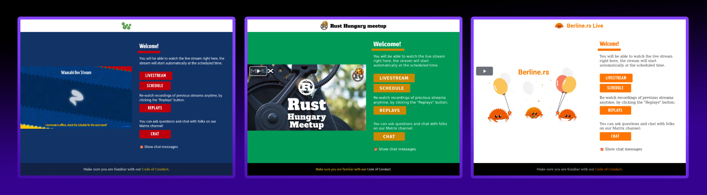

# Live User Interface

The Waasabi Live UI is where the magic happens! This fully customizable interface presents the live streaming experience and the various other data sources (such as chat, live captions and HTML interactive experiences) in a cohesive whole.

Even for those who do not want to extend the Live UI, a straightforward branding interface makes it possible to adjust the looks to match their needs.

::: info UPCOMING
A detailed writeup on the livepage customization options and branding workflow is coming soon in this section.
:::
