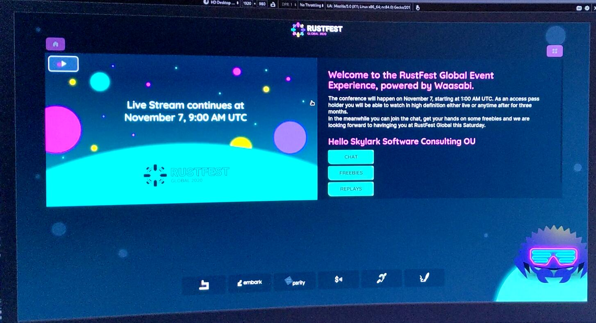
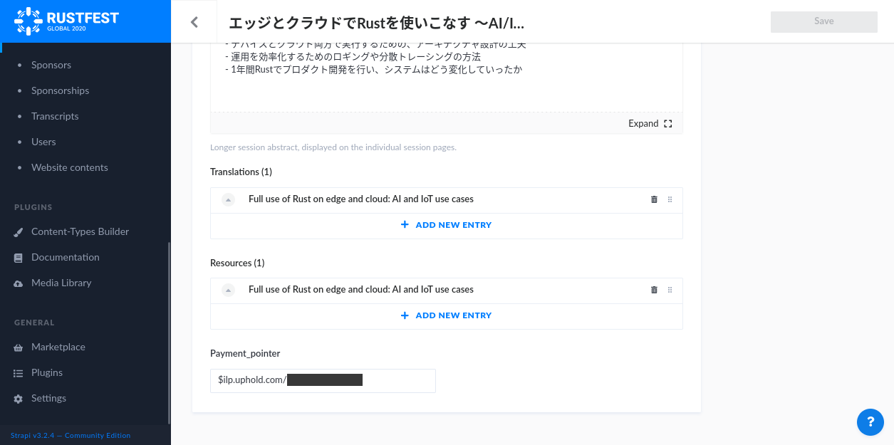
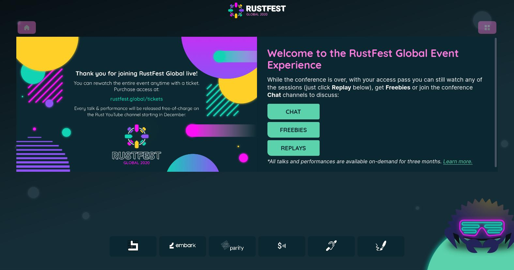
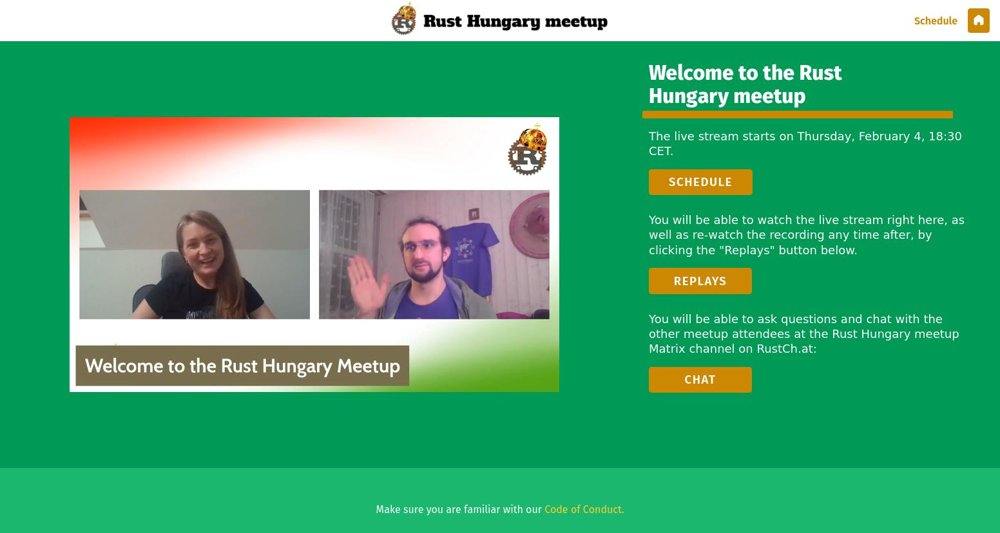
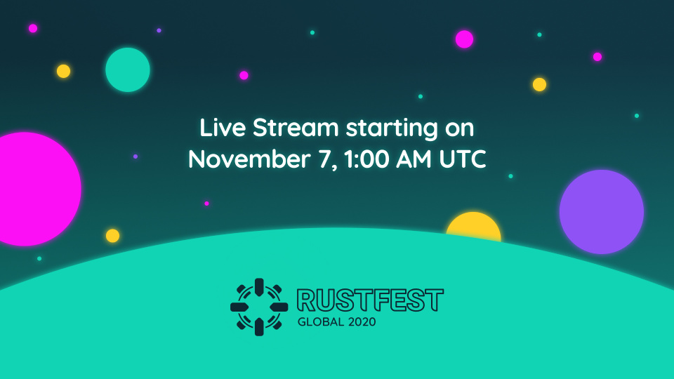

---

next:
  text: "Waasabi development update: Chat Integrations" 
  link: /news/2021-05-27-update-chat-integrations

---

<!--

# 2021-05-11-progress-update

* https://opencollective.com/waasabi/updates/waasabi-progress-update
* https://community.webmonetization.org/waasabi/waasabi-live-event-framework-grant-report-1-8l1
* https://web.archive.org/web/20220629214742/https://community.webmonetization.org/waasabi/waasabi-live-event-framework-grant-report-1-8l1

-->

# Waasabi live event framework — Grant Report #1

<small>

*2021-05-11, originally published on [Open Collective](https://opencollective.com/waasabi/updates/waasabi-progress-update) & the [Web Monetization Community blog](https://web.archive.org/web/20220629214742/https://community.webmonetization.org/waasabi/waasabi-live-event-framework-grant-report-1-8l1)*

</small>

Waasabi's idea first formed in March 2020. As an avid conference-goer and organizer I, too, like many others, was [disillusioned](https://musings.flak.is/tallinnrs-march2020/). Most events that have "moved online" felt like giant square expo-center-pegs, stuffed into a round internet-hole, mere pale digital reflections of a bygone era of physical attendance.

Soon enough I realized much of this was not even for lack of trying: as we ourselves first embarked on the journey of bringing about a _much remote, very online_ [RustFest](https://blog.rustfest.eu/past_events/) experience I had to face first-hand the frustrating lack of tools for creating unique, inclusive, engaging online event experiences.

The task at hand was clear: _we had to build it_.

After some experimentation by late spring an [early prototype](https://web.archive.org/web/20220629214742/https://waasabi.baytech.community/about-this-prototype.html) provided the outline to what later that fall was to become the [live streaming experience of RustFest Global](https://watch.rustfest.global/): one of the largest conferences for the Rust programming language, and one _truly_ spanning the globe, with speakers and artists spread across multiple continents, languages and timezones.

**The Waasabi prototype used to power the RustFest Global online conference stream experience**

### Project Update

Receiving a grant from Grant for the Web meant not only that we could experiment with new, unconventional funding and reward models built around Web Monetization, but has also given us a chance to continue the work well after the conference, turning the prototype powering RustFest Global's live experience into a tool that may be used by anyone and for a much wider range of use cases.

This transition is going well and we are gearing up to publishing the first edition of Waasabi, with continuous updates to follow afterwards.

### Progress on objectives

In the past months tremendous progress has been made on executing on the project's initial goals. Below we will illustrate some of this progress in the context of the original objectives:

_Waasabi set out to…_

#### _“Solve the "hard problems" of event streaming and allow event organizers to build custom experiences around this core”_

Almost any event that tries to create their own experience will eventually face implementing video broadcasts in one way or another. Waasabi, as you will notice, is wont to stray from the "tried and true", and video streaming is a good example of this.

Waasabi supports (encourages, even!) splitting up long events into short, per-session live streams. This small change in approach has surprisingly broad implications to the attendee experience! On the one hand, it allows for immediate publishing individual sessions for on-demand viewing (we simply call these ["Replays"](https://rustfest.global/information/how-to-watch/#replays)) right after the live session has concluded — this makes events much more inclusive, especially on a global scale, as everyone can "adjust" the conference to their own schedules, instead of aligning with whatever the broadcast schedule mandates.

<iframe src="/news/embeds/rfg.html#thread" class="tweet-embed" width="480" height="400">
	Embedded transcript of a <a href="https://twitter.com/slsoftworks/status/1325045310347997185">Twitter Thread</a> from Nov. 7, 2020. <a href="https://threadreaderapp.com/thread/1325045310347997185.html">Unrolled thread.</a>
</iframe>

Another interesting implication of this change is that the breaks between sessions become a space we can fill with valuable, even interactive content. Whether it's generative art, interactive sponsor experiences or an embedded experience dedicated for connecting and _mingling_, the live stream gives way for other custom experiences, reclaiming its rightful prime real estate on the user's screen once a new live broadcast is due.

<iframe src="/news/embeds/rfg-pre.html#thread" class="tweet-embed" width="480" height="400">
	Embedded transcript of a <a href="https://twitter.com/slsoftworks/status/1323334120483770370">Tweet</a> from Nov. 2, 2020.
</iframe>

#### _“Provide flexible, extensible tools for organizers who want to experiment with alternative formats and business models”_

Most commercial event platforms on the market today provide ready-made "just-add-water" experiences out of the box today. There is very little room for customization, integrations, or ways to engage with one's audience beyond what was pre-imagined by the platform's UX & design teams.

Another large chunk of events, who decided to simply opt for broadcasting their event on one of the large video streaming platforms are similarly limited: both YouTube and Twitch, two predominant providers in the space allow for very little access control over their broadcast, and do their utmost to keep revenue sources limited to and dependent on their own silos (ad revenue, subscriptions, etc.).

In either case, events have very little control over _how_ their broadcast is presented, and _who_ has access to it, thus it is pretty much impossible to freely experiment with a novel combination of micropayments, ticketing, sponsorships etc.

<video src="https://s3.flak.is/waasabi/media/embeds/fade.mp4" autoplay muted loop style="margin: 2rem auto">
	Video also available in the GIF format: 
</video>

**The RustFest Global live stream design subtly shifts in realtime to reveal one of the sponsors ahead of an upcoming talk**

Retaining full control over the streaming experience also meant that we could offer interesting alternate ways to [showcase our sponsors](https://twitter.com/slsoftworks/status/1325059192537948161) and allow them to engage in more meaningful ways with our audience — something that would be impossible in any of the conventional platforms. This meant that we have been able to provide value (and on this, we have received unequivocally positive feedback) to sponsors while keeping these appearances unobtrusive (e.g. instead of stuffing the live stream & recording full of distracting logos), which has been a key goal of our community-centered conference since its inception.

#### _“Enable increased reach through more sophisticated control over content distribution and revenue sources”_

Having full control of every aspect of the video streaming experience allowed us to [set our own rules](https://rustfest.global/information/tickets/), even provide free & pay-what-you-can style ticket options, while still retaining [appealing incentives](https://rustfest.global/information/how-to-watch/#differences-between-public-and-paid-streams) to those who would support the conference by buying tickets. That said, when it came to Web Monetization, we had [a different issue in mind](https://rustfest.global/information/about-web-monetization/) that we set out to solve.

Many events today [support and incentivize](https://rustfest.global/cfp/#the-perks) content submissions by acknowledging the work put into creating a talk and the effort spent on educating the community. At RustFest we paid all our artists, given stipends and video streaming hardware reimbursements to our speakers in an effort to lower the barrier of entry for participation and sharing one's art and knowledge with the community.

<iframe src="/news/embeds/rfg-newspeak.html#thread" class="tweet-embed" width="480" height="400">
	Embedded transcript of tweets in this <a href="https://twitter.com/ai_maiga/status/1325099959809679361">Thread</a> from Nov. 7, 2020.
</iframe>

We decided to use Web Monetization as yet another tool that would allow the _community_ to give back to these artists and speakers, even long after the conference is over.

Every session at RustFest could provide its own ILP payment pointer (set by the session host or administrators) which would be active during the live broadcast of the session, as well as during any on-demand playback. This way, Web Monetization supported the creator directly, while RustFest merely provided the infrastructure and the "marketplace" to connect presenters with their audience.

* * *

Work on some of the initial objectives is still ongoing, see more information on these in the "What's next" section, as well as expect to see further updates on their progress in the coming weeks.

### Key activities

Field-testing Waasabi's ideas in a realistic setting was one of our main tasks for 2020, and the RustFest Global conference provided fertile grounds for experimentation. After the conference ended, we took the distilled learnings and the prototype to create a more streamlined, more flexible tool that can be customized to fit one's own usecase.

#### RustFest Global

We believe RustFest Global was the first event that [took advantage of Web Monetization](https://rustfest.global/information/about-web-monetization/) in the online conference space. RustFest's approach was using Web Monetization as a secondary income stream for artists & presenters at the event, and on the long tail. With close to 1.000 signups, RustFest streamed over 4.000 hours of content & produced 15 hours of talks and art performances.

For most of our presenters, Web Monetization was completely new, and had a great reception, especially among our artists, with ~50% signing up and registering a wallet to monetize their content. Even after the conference, [recordings published on Cinnamon Video](https://cinnamon.video/rustfest), as well as those watched on [the conference website](https://2020.rustfest.global/schedule/) would remain monetized towards the creator to provide a long tail revenue to the creator. To this date, our Cinnamon channel has seen over 600 views across all published talks and art performances.

In the post-conference survey the artists were also expressing their enthusiasm towards Web Monetization and were interested in using it in their future appearances and on their own websites, which further reinforced our suspicion that Web Monetization was especially well-suited to cater for content producers and performers in the virtual event space.

#### Continued adoption

Since RustFest we have spent the past months with streamlining Waasabi's offering and working slowly towards the public release & open sourcing of the first components under [Bay Area Tech Club's umbrella](https://baytech.community/eng/projects/). The various individual components of Waasabi will be released under an [Apache 2.0](https://opensource.org/licenses/Apache-2.0) license, awaiting contributions on Bay Area Tech Club's [GitHub page](https://github.com/baytechc/).

The components are written in a wide range of technologies — from HTML/CSS/JavaScript to Rust and a variety of frontend and backend frameworks. While for a company with a specialized team such a varied tech stack could very well be a nightmare-scenario to maintain, it is absolutely intentional here: we believe this allows contributors to pick & choose to work on parts of the Waasabi suite that they feel most comfortable in.

**Rust Hungary's online community meetup hosted on Waasabi**

While Waasabi will be sure to power any upcoming editions of RustFest, we have also started reaching out [to the first early adopters](https://meetup.rust-lang.hu/) to help us test-drive the suite's offering. We are working with these communities, meetups and conferences to ensure the out-of-the box offering supports a wide range of use cases, and focusing on improving the maintainability of instances. This means both streamlining the initial configuration, as well as making sure keeping them up-to-date is as painless as possible.

Work is well underway on `waasabi-init`, a command line tool dedicated to provisioning a brand new Waasabi configuration, either for local development, or one that is intended for a live installation. This tool will be responsible not only for applying customizations, but selecting, installing and keeping the various components of the Waasabi suite up to date. Much of our current efforts are channeled into improving the usability and lowering the barrier of entry of a Waasabi-based setup by abstracting away much of the underlying complexity.

<video src="https://s3.flak.is/waasabi/media/embeds/waasabi-init.mp4" autoplay muted loop style="margin: 2rem auto">
	Video also available in the GIF format: 
	<!--  -->
</video>

**Waasabi's configurator in action**

_If this blog post has piqued your interest in adopting Waasabi for your community, please reach out in the contacts at the end of the article, we would love to hear from you!_

#### Communications and marketing

While most of the work so far has taken place behind the scenes, in anticipation of the upcoming first release we have started live streaming Waasabi development — on Waasabi itself! This may unarguably feel _a bit meta_, but is giving us an excellent opportunity to _eat our own dogfood_, as well as being a useful venue for raising awareness and gathering feedback. Currently the streams are a bit ad-hoc (follow the Waasabi Matrix channel for when to look), but we should settle in for a nice cadence once we have worked out some of the kinks.

[Join the Waasabi Dev Streams at live.waasabi.org!](https://live.waasabi.org/)

<video src="https://s3.flak.is/waasabi/media/embeds/devstream.mp4" autoplay muted loop style="margin: 2rem auto">
	Video also available in the GIF format: 
	<!--  -->
</video>

**The Waasabi Dev Stream in action!**

### What’s next?

We haven't yet talked about external integrations and optional components ("plugins"), so let's have a look at what's coming to Waasabi in these areas:

#### _“Allow event organizers to tightly integrate their live events into their existing community infrastructure”_

Just weeks ago the Matrix team [debuted the official experience](https://matrix.org/blog/2021/02/15/how-we-hosted-fosdem-2021-on-matrix) they envisioned for using the federated Matrix protocol in conjunction with online events.

Months ahead of this, in November last year we also used the Matrix network to power RustFest Global's chat experience through our own custom integration and our own [RustCh.at](https://rustch.at/) Matrix server instance.

We are working on including a cleaned up & streamlined version of this integration in the components offered by Waasabi for those who would like to use this chat system with their custom streaming experience. We are also working on plugins for other popular chat platforms, to make it even easier to connect communities across Waasabi's interface simply by selecting and configuring the right integration, available out of the box.

#### _“A growing library of open source plugins and integrations contributed back by the community building on Waasabi”_

While releasing & open sourcing the Waasabi codebase will need to take place before we can start talking about community-contributed extensions to the Waasabi software suite, we have already started laying the foundations to this through spending considerable effort on ensuring a low barrier of entry to trying, installing, using and contributing to Waasabi.

One of Waasabi's planned optional components was a "proof-of-concept" to a local transcription/captioning service, based in open data and open source software. We thought sharing the findings of this effort will deserve its own update, and thus keep an eye out for a coming update on this project in the following weeks. Check out a little teaser below of what we have in the works:

A comparison between a human-generated talk transcript and one generated by our automated local captioning proof-of-concept from RustFest Global

#### Future development

We are also thrilled to announce that thanks to the [NLnet Foundation](https://nlnet.nl/) Waasabi has been [recently awarded a grant](https://nlnet.nl/project/Waasabi/) from the NGI Zero initiative!

This project is still the planning/roadmapping phase but thanks to the new grant we will soon be able to start working on integrating P2P (peer-to-peer) video streaming backends as an alternative to Waasabi's current, commercial provider. We look forward to exploring technologies like HLS-over-IPFS and the recently announced [PeerTube live streaming support](https://framablog.org/2021/01/07/peertube-v3-its-a-live-a-liiiiive/).

### What community support would benefit your project?

If the project's goals resonated with you, please consider supporting development through our [Open Collective page](https://opencollective.com/waasabi).

If you would like to test-drive Waasabi for one of your own communities or events ahead of the public release, please let us know through any of the contacts listed below, we are always looking for feedback and early adopters who can help us improve Waasabi.

### Relevant links/resources

*   [Support Waasabi on Open Collective](https://opencollective.com/waasabi)
*   [The Waasabi chatroom on Matrix](https://matrix.to/#/#waasabi:baytech.community)
*   [Follow the Waasabi Dev Streams on live.waasabi.org](https://live.waasabi.org/)
*   [For updates follow the @bayareatechclub Twitter](https://twitter.com/bayareatechclub)
*   [Subscribe to the RustFest newsletter to learn about future events](https://rustfest.global/)

* * *

> _Updated 2021.03.12_: an earlier version of the post stated RustFest streamed 45.000 hours of content, this was incorrect, the correct number is around 4.400 hours, which is still _half a year_ worth of RustFest!
